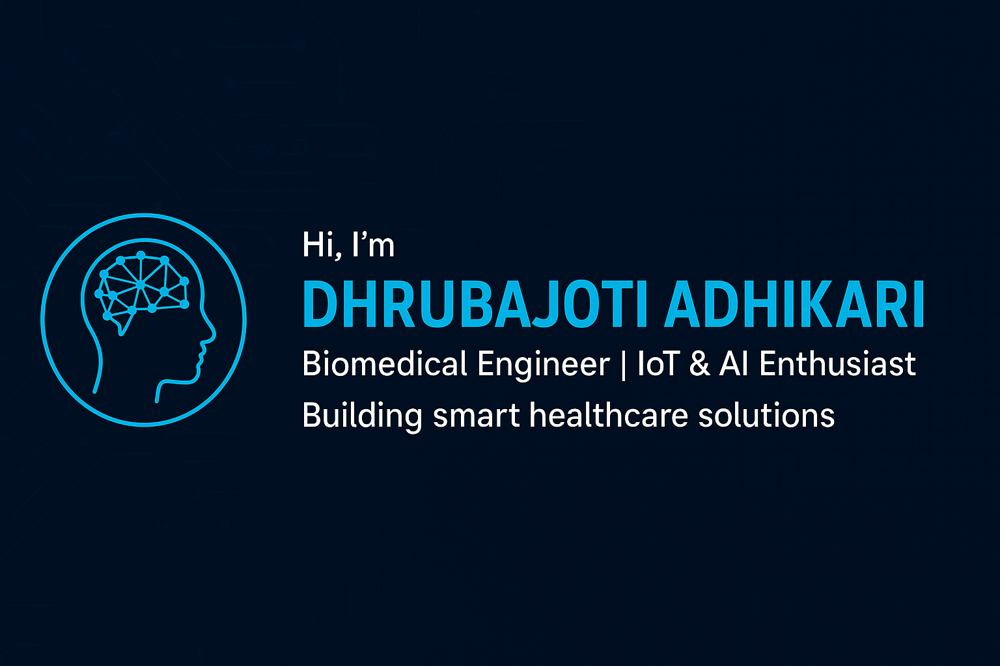

<!-- Banner -->

  

# Hi, I'm Dhrubajoti Adhikari 👋

**Biomedical Engineer** · **IoT & AI Enthusiast**  
I build smart healthcare solutions by merging **biomedical instrumentation**, **IoT**, and **machine learning**.  

---

## 🛠 Tech Stack
**Languages:** Python, C, MATLAB  
**IoT & Embedded:** Arduino, ESP32, MAX30102, AD8232, LM35  
**ML & Data:** scikit-learn, TensorFlow, Pandas, NumPy  
**Tools:** Git, GitHub, Google Colab, CodePen

---

## 🚀 Featured Projects
- **Health Ninja: Smart Device for Early Detection of Cardiopathy and Induced Stress Condition** — IoT device for cardiopathy detection (ESP32, MAX30100, AD8232, ML)  
- **Dehydration Monitoring System** — Uses temperature, humidity & GSR sensors to detect dehydration  

> 👉 I’ll pin these repos on my profile for quick access.

---

## 📈 GitHub Snapshot

---

## 📜 Certifications
- **Python Programming (30 hours)** — Euphoria GenX
- **Application of Machine Learning in healthcare (30 hours)** - Ardent Computech Pvt. Ltd.

---

## 📫 Contact
**LinkedIn:** _https://www.linkedin.com/in/dhrubajoti-adhikari_ • **Email:** _adhikaridhrubo@gmail.com_  
*“Code is my stethoscope — I debug health.”*

